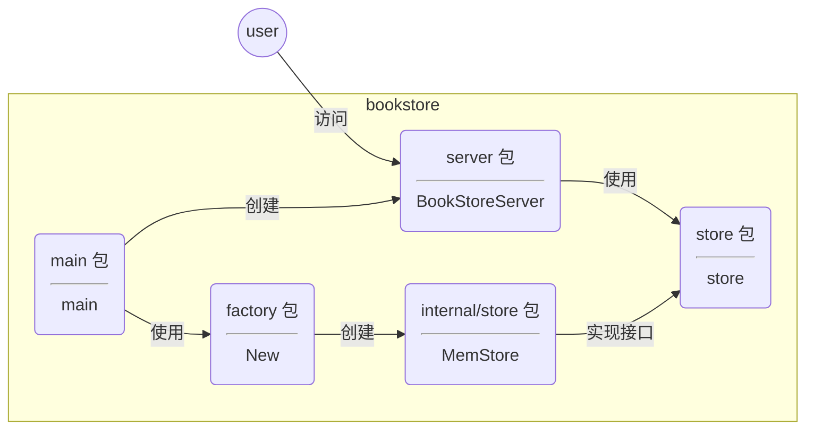

## 构建一个图书管理服务 API

RESTful API

| HTTP 方法 | 请求 URI     | API 含义 ｜          |
| --------- | ------------ | -------------------- |
| POST      | /book        | 创建一条新的图书记录 |
| POST      | /book/\<id\> | 更新一条图书记录     |
| GET       | /book/\<id\> | 返回特定图书记录     |
| GET       | /book        | 返回所有图书记录     |
| DELETE    | /book/\<id\> | 删除特定图书记录     |

项目目录结构

```shell
» tree -LF 3
├── cmd/
│   └── bookstore/
│       └── main.go        # 主程序
├── internal/
│   └── store/
│       └── memstore.go    # 实现 Store 接口的 map 内存数据库
├── server/                # 对外提供 HTTP API 服务，处理来自客户端的各种请求
│   ├── middleware/        # 一些通用的 http 处理函数
│   │   └── middleware.go
│   └── server.go
└── store/
    ├── factory/
    │   └── foctory.go     # Go 风格的工厂模式，用于创建满足 Store 接口的实例
    └── store.go           # 图书数据存储模块
```

模块说明



创建 module 

```shell
» go mod init bookstore
» go mod tidy
```

编写代码
...

编译、执行

```shell
» go mod tidy
go: finding module for package github.com/gorilla/mux
go: downloading github.com/gorilla/mux v1.8.1
go: found github.com/gorilla/mux in github.com/gorilla/mux v1.8.1

» go build cmd/bookstore/main.go 
» ./main
2024/06/07 22:25:52 web server start ok
```

测试/验证

```shell
» curl -i -H "Content-Type:application/json" localhost:8080/book
HTTP/1.1 200 OK
Content-Type: application/json
Date: Fri, 07 Jun 2024 15:25:15 GMT
Content-Length: 2

[]%

» curl -X POST -H "Content-Type:application/json" -d '{"id": "978-7-111-55842-2", "name": "The Go Programming Language", "authors":["Alan A.A.Donovan", "Brian W. Kergnighan"],"press": "Pearson Education"}' localhost:8080/book

» curl -i -H "Content-Type:application/json" localhost:8080/book
HTTP/1.1 200 OK
Content-Type: application/json
Date: Fri, 07 Jun 2024 15:25:33 GMT
Content-Length: 146

[{"id":"978-7-111-55842-2","name":"The Go Programming Language","authors":["Alan A.A.Donovan","Brian W. Kergnighan"],"press":"Pearson Education"}]%

» curl -i -H "Content-Type:application/json" localhost:8080/book/978-7-111-55842-2
HTTP/1.1 200 OK
Content-Type: application/json
Date: Fri, 07 Jun 2024 15:28:10 GMT
Content-Length: 144

{"id":"978-7-111-55842-2","name":"The Go Programming Language","authors":["Alan A.A.Donovan","Brian W. Kergnighan"],"press":"Pearson Education"}%

» curl -X DELETE -H "Content-Type:application/json" localhost:8080/book/978-7-111-55842-2
HTTP/1.1 200 OK
Date: Fri, 07 Jun 2024 15:30:58 GMT
Content-Length: 0

» curl -i -H "Content-Type:application/json" localhost:8080/book/978-7-111-55842-2
HTTP/1.1 400 Bad Request
Content-Type: text/plain; charset=utf-8
X-Content-Type-Options: nosniff
Date: Fri, 07 Jun 2024 15:31:50 GMT
Content-Length: 10

not found
```

服务器端的输出日志

```shell
» ./main
2024/06/07 23:25:09 web server start ok
2024/06/07 23:25:15 recv a GET request from [::1]:56608
2024/06/07 23:25:25 recv a POST request from [::1]:56649
2024/06/07 23:25:33 recv a GET request from [::1]:56678
2024/06/07 23:28:10 recv a GET request from [::1]:57315
2024/06/07 23:30:58 recv a DELETE request from [::1]:57994
2024/06/07 23:31:50 recv a GET request from [::1]:58205
```